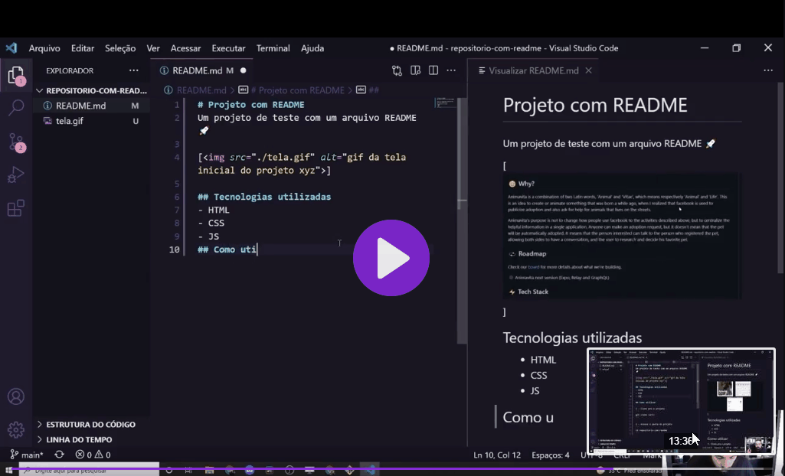

# Projeto com README
um projeto de teste com um arquivo README 🚀

[]

## Tecnologias usadas 
- HTML
- CSS
- JS

## Como utilizar

1 - Clone o projeto
```
git clone <url>
```

2 - Acesse a pasta do projeto
```
cd repositorio-com-readme
```